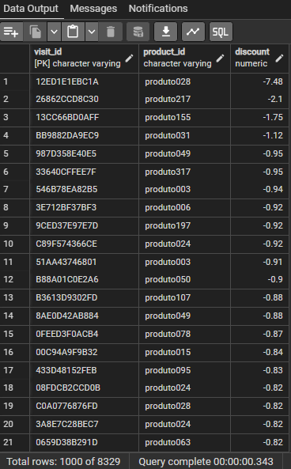
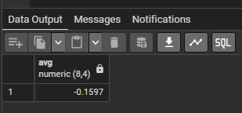

# Projeto de Banco de Dados - SQL/PostgreSQL

Desenvolvimento de Projeto de Banco de Dados com SQL/PostgreSQL. `Desafios, Questões 01-10, Módulo 01 (SQL).` 

Instituição: [Digital College Brasil](https://digitalcollege.com.br/) (Fortaleza/CE) <br>
Curso: Data Analytics (Turma 18) <br>
Instrutora: [NayaraWakweski](https://github.com/NayaraWakewski) <br>

<br>

## Etapas de Desenvolvimento

### Enunciado das Questões:
 <br>
 <br>
 <br>    
<br>

## Restore do Banco de Dados
- Criar banco de dados: vendas_desafio (Interface gráfica). <br>
 <br>

- Fazer "Restore" do banco de dados (Interface gráfica). <br>
 <br>

## Questão 1
- Selecione todos os registros da tabela sales.funnel, exibindo as colunas visit_id, customer_id product_id, e store_id. <br>

- Comandos SQL: <br>
```
SELECT visit_id, customer_id, product_id, store_id
FROM sales.funnel;
``` 
<br>

- Visualização: <br>


<br>

## Questão 2
- Liste todos os produtos (product_id) que foram adicionados ao carrinho, exibindo também as datas em que isso ocorreu (add_to_cart_date). <br>

- Comandos SQL: <br>
```
SELECT product_id, add_to_cart_date
FROM sales.funnel
WHERE add_to_cart_date IS NOT NULL
ORDER BY add_to_cart_date;
``` 
<br>

- Visualização: <br>


<br>

## Questão 3
- Recupere todos os registros onde a data de pagamento (paid_date) não é nula. Exiba os campos visit_id, customer_id, e paid_date. <br>

- Comandos SQL: <br>
```
SELECT visit_id, customer_id, paid_date
FROM sales.funnel
WHERE paid_date IS NOT NULL
ORDER BY paid_date;
``` 
<br>

- Visualização: <br>


<br>

## Questão 4
- Liste as visitas onde o cliente iniciou o processo de checkout (start_checkout_date), exibindo as colunas visit_id, customer_id, product_id e start_checkout_date. <br>

- Comandos SQL: <br>
```
SELECT visit_id, customer_id, product_id, start_checkout_date
FROM sales.funnel
WHERE start_checkout_date IS NOT NULL
ORDER BY start_checkout_date;
``` 
<br>

- Visualização: <br>


<br>

## Questão 5
- Encontre as visitas onde o desconto aplicado foi maior do que 20% (discount < -0.20). Exiba as colunas visit_id, product_id, e discount. <br>

- Comandos SQL: <br>
```
SELECT visit_id, product_id, discount
FROM sales.funnel
WHERE discount < -0.20
ORDER BY discount;
``` 
<br>

- Visualização: <br>


<br>

## Questão 6
- Selecione as visitas feitas por clientes em lojas específicas. Liste todos os registros onde o store_id é 'BF580E604866'. Exiba as colunas visit_id, customer_id, product_id, e store_id. <br>

- Comandos SQL: <br>
```
SELECT visit_id, customer_id, product_id, store_id
FROM sales.funnel
WHERE store_id = 'BF580E604866'
ORDER BY product_id;
``` 
<br>

- Visualização: <br>


<br>

## Questão 7
- Calcule a média do desconto aplicado em todas as transações. Exiba a média do campo discount. <br>

- Comandos SQL: <br>
```
SELECT AVG (discount)::NUMERIC(8,4)
FROM sales.funnel;
``` 
<br>

- Visualização: <br>


<br>


## Meus Contatos

- Business Card - [Renato Albuquerque](https://rma-contacts.vercel.app/)
- Linkedin - [renato-malbuquerque](https://www.linkedin.com/in/renato-malbuquerque/)
- Discord - [Renato Albuquerque#0025](https://discordapp.com/users/992621595547938837)

[def]: /images/q5.png